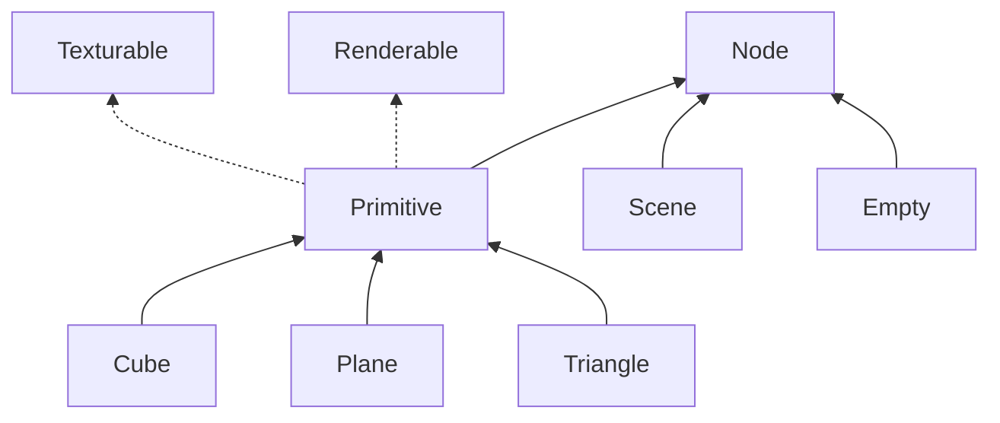

# chkRenderer
Simple 3D renderer in Swift for macOS

Features a simple Scene graph of Node objects.

TODO List:
  - Render 3D models in OBJ format
  - Make a simple scene editor mode
  - Add Keyboard controls
  - Add Mouse controls
  - Make some relatively complex scene for testing.
